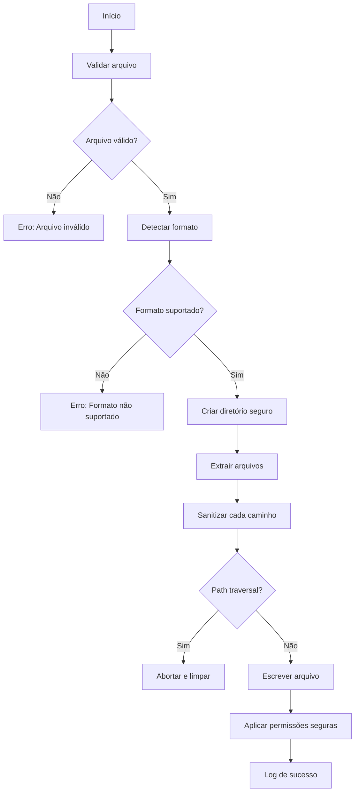

# 🔓 Descompactador de Arquivos Avançado

[](https://jp-linux.github.io)

[](https://opensource.org/licenses/MIT)

Uma ferramenta profissional para descompactação segura de arquivos com proteção contra vulnerabilidades e tratamento robusto de erros.

## 🛡️ Novos Recursos de Segurança
- **Proteção contra Path Traversal Attacks**
- **Verificação rigorosa de permissões**
- **Sanitização de caminhos durante extração**
- **Limpeza automática em caso de falha**
- **Manutenção de permissões seguras (0700)**
- **Detecção de arquivos maliciosos**
- **Logs detalhados em arquivo (`descompactador.log`)**

## 📋 Recursos
- **Formatos suportados**: `.zip`, `.tar`, `.tar.gz`, `.tar.bz2`, `.tar.xz`
- Detecção automática de formato com prioridade para combinações
- Validação de integridade de arquivos (teste ZIP completo)
- Prevenção contra extração de arquivos perigosos
- Códigos de saída diferenciados para cada tipo de erro
- Mensagens intuitivas com emojis visuais
- Suporte a permissões originais (quando seguras)

## 📦 Pré-requisitos
- Python 3.8+
- Nenhuma dependência externa necessária

## ⚙️ Instalação
```bash
git clone https://github.com/JP-Linux/descompactador.git
cd descompactador
chmod +x descompactador.py  # Tornar executável
```

## 🚀 Como Usar
### Descompactação básica:
```bash
./descompactador.py arquivo_compactado.extensao
```

### Especificando diretório de saída:
```bash
./descompactador.py arquivo_compactado.zip saida/
```

### Exemplos:
```bash
# Descompactar .tar para diretório específico
./descompactador.py backup.tar backup/

# Descompactar .tar.gz mantendo permissões
./descompactador.py backup.tar.gz documentos/

# Tentar extrair arquivo malicioso (será bloqueado)
./descompactador.py arquivo_perigoso.zip
```

## 🛑 Possíveis Erros e Códigos de Saída
| Código | Erro                          | Descrição                                  |
|--------|-------------------------------|--------------------------------------------|
| 0      | Sucesso                       | Extração concluída com êxito               |
| 1      | Erros conhecidos              | Arquivo inválido/formato não suportado     |
| 2      | Erro inesperado               | Exceção não tratada (verifique logs)       |
| 130    | Interrupção usuário           | Processo cancelado (Ctrl+C)                |

Exemplos de mensagens:
```bash
# Tentativa de path traversal
❌ Erro de processamento: Tentativa de path traversal detectada: ../../etc/passwd

# Permissão negada
❌ Erro de processamento: Permissão negada para ler o arquivo: secreto.zip

# Arquivo corrompido
❌ Erro de processamento: Arquivo ZIP corrompido: documento.docx
```

## 🧩 Como Funciona (Arquitetura Segura)


## 🔒 Medidas de Segurança Implementadas
1. **Path Traversal Prevention**: Verifica cada caminho extraído
2. **Safe Permissions**: 
   - Diretórios criados com 0700
   - Permissões de arquivos filtradas (remove setuid/sticky bits)
3. **Secure Cleanup**: Remove arquivos parciais em caso de erro
4. **Corruption Checks**: Teste de integridade completo em arquivos ZIP
5. **Input Validation**: Verificação rigorosa de formatos e permissões
6. **Activity Logging**: Auditoria completa em arquivo de log

## 👤 Autor

**Jorge Paulo Santos**  
[](https://github.com/JP-Linux)
[](mailto:jorgepsan7@gmail.com)

## 📄 Licença

Este projeto está licenciado sob a Licença MIT - veja o arquivo [LICENSE](LICENSE) para detalhes.
